# NotaPro

NotaPro es una aplicación web construida con Next.js para gestionar de forma eficiente las calificaciones en una escuela secundaria. Permite crear y administrar usuarios como docentes, estudiantes y familiares, gestionando de manera clara, rápida y accesible las calificaciones de los estudiantes.

## Tecnologías utilizadas:

<ol className="flex flex-col gap-1">
  <li>Next.js como framework principal</li>
  <li>Prisma como ORM para manejar la base de datos</li>
  <li>SQLite como motor de base de datos</li>
  <li>Tailwind CSS para el diseño responsivo</li>
  <li>ShadCN para una interfaz moderna y accesible</li>

</ol>

## Posibles Futuras Mejoras

En el futuro pueden agragarse más funciones como registrar asistencia, un calendario principal para en el inicio de cada perfil o incluso un chat privado entre los usuarios.
Otra idea puede ser la posibilidad de establecer las fechas de inicio y fin de los períodos lectivos y que al finalizarse se generen automátiamente planillas con los promedios de los estudiantes

## Algunas imágenes del proyecto
  <ol>
          <li><h3>Primer vistazo: Establecer administrador</h3>
          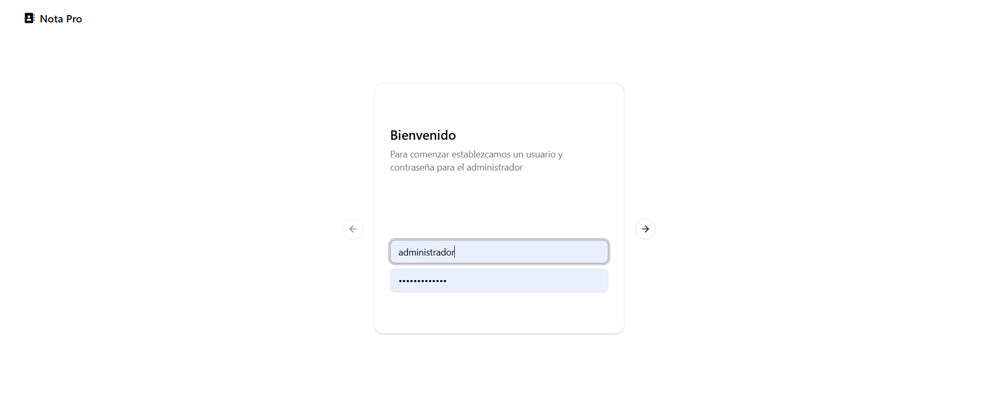 
          <h4>Creando las primeras cuentas</h4>
          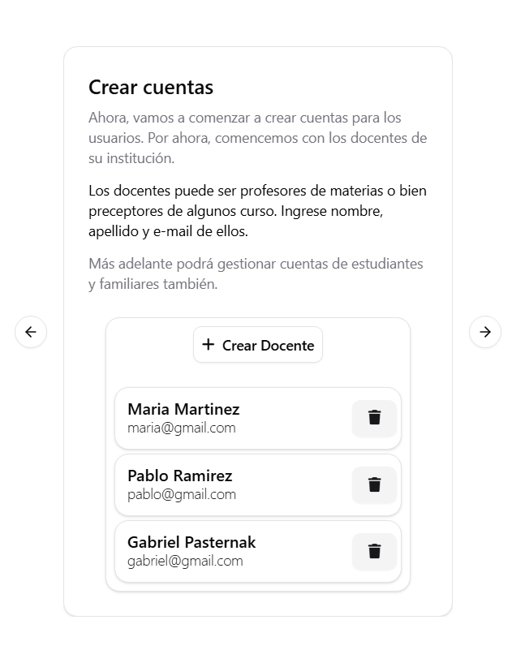
          <h4>Terminando las primeras configuraciones</h4>
          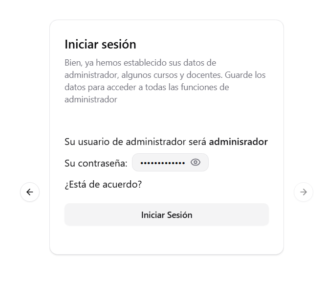  </li>
          <li><h3>Inicio de Sesión</h3>
          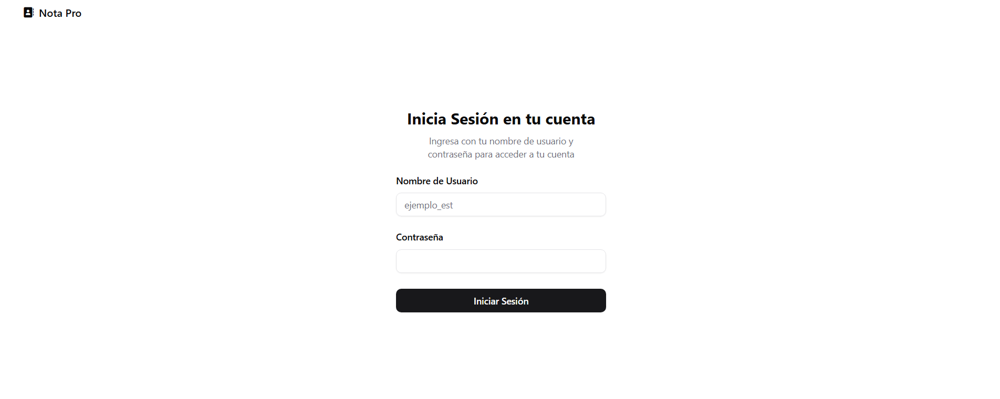 </li>
          <li><h3>Página del administrador</h3>
          <h4>Gestionar Cursos</h4>
          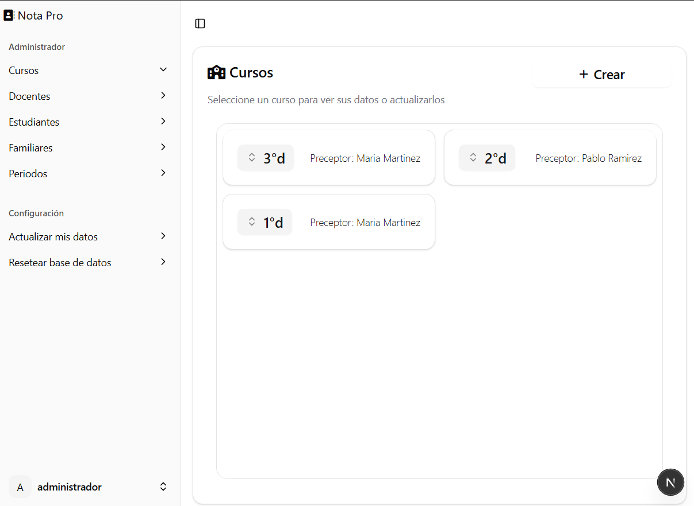 
          <h4>Gestionar Docentes</h4>
          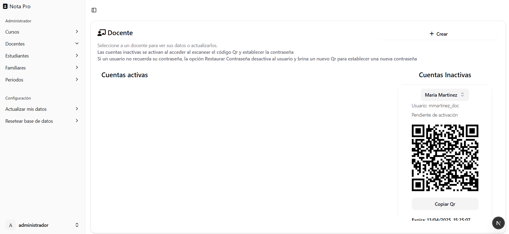 
          <h4>Gestionar Estudiantes</h4>
          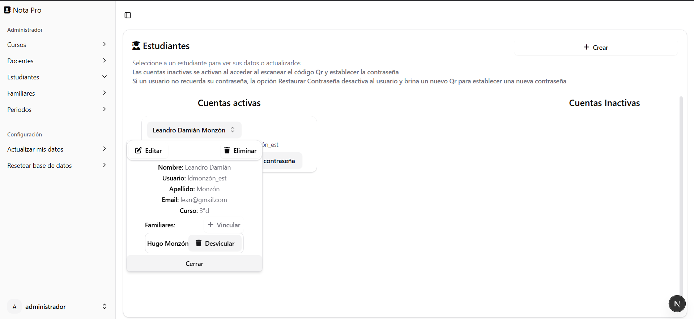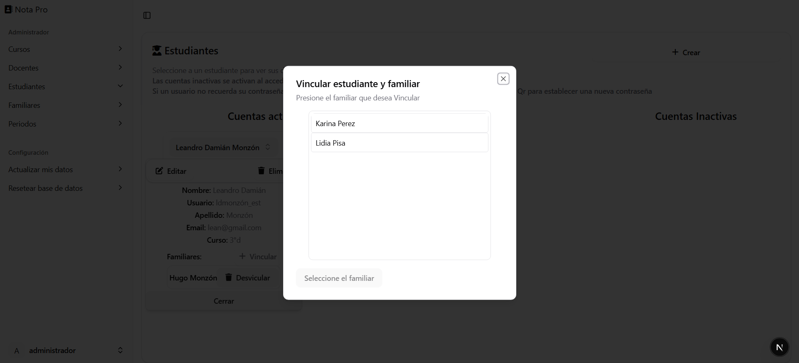</li>
    <li><h3>Activando Cuentas</h3>
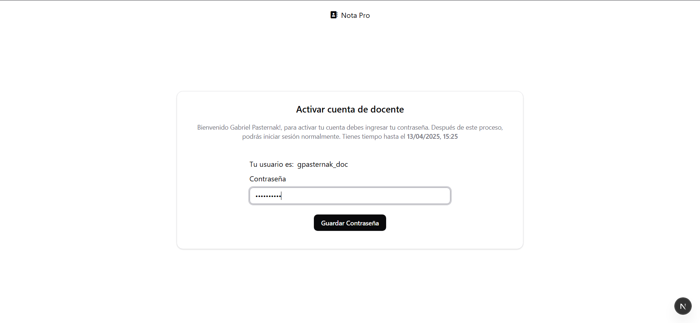</li>
          <li><h3>Cuentas de docentes</h3>
          <h4>Como Preceptor</h4>
          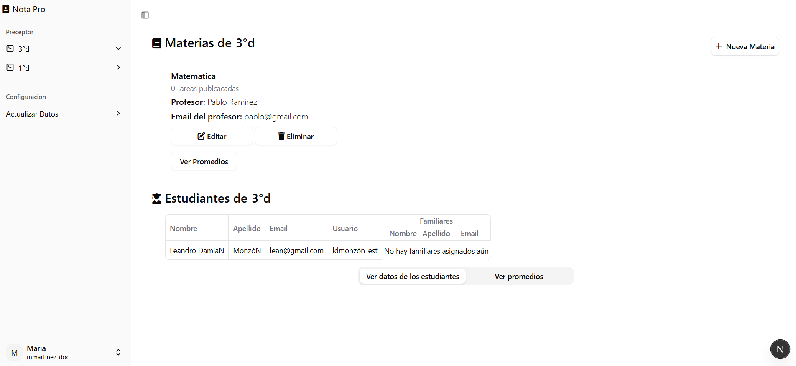   
          <h3>Profesor, creando tareas</h3>
          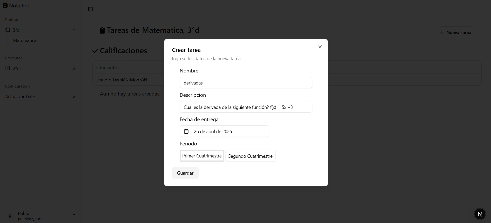   
          </li>
          <li><h3>Cuentas de estudiantes</h3>
          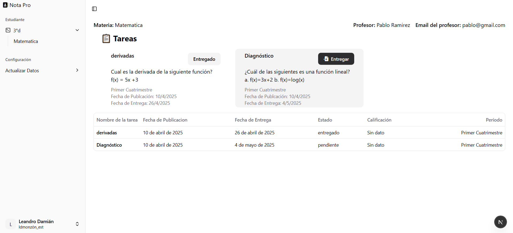 </li>
    <li>          <h4>Como Profesor, corrigiendo tareas</h4>
          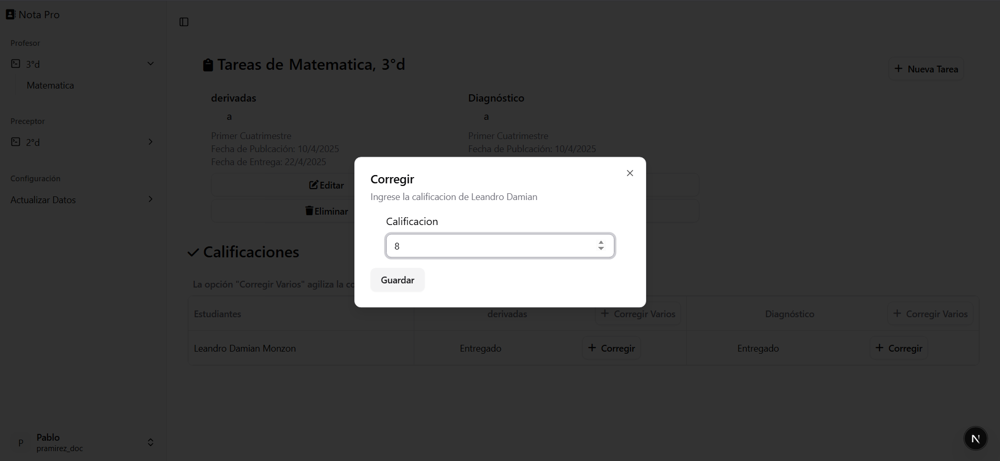
          <li><h3>Cuentas de familiares </h3>
          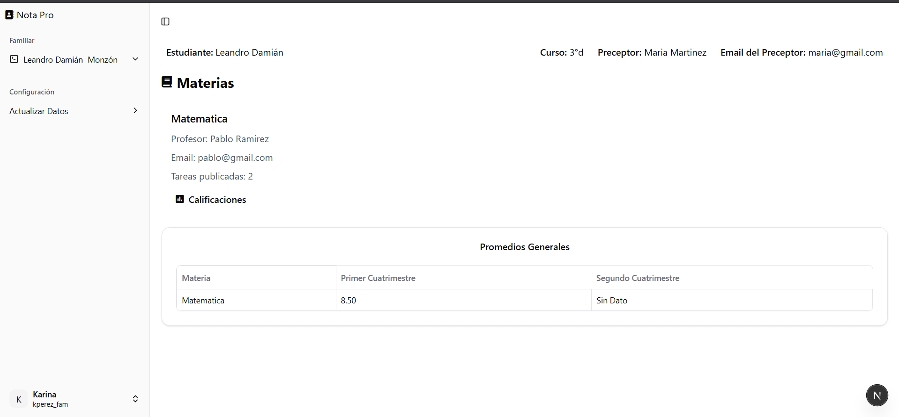 
          <h4>Viendo calificaciones</h4>
          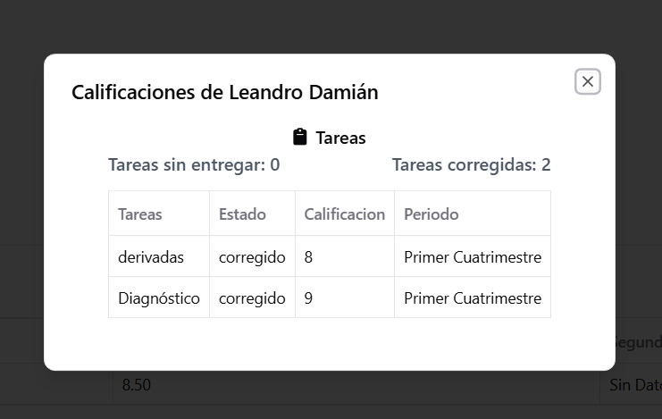 
          </li>
          </ol>

## Paso a paso para inicializar el proyecto
  <ol>
          <li>Descarga y descomprime el proyecto.</li>
          <li>
            Abre una terminal en la carpeta del proyecto y ejecuta el
            siguiente comando para instalar las dependencias:
            <pre><code>npm install --legacy-peer-deps</code></pre>
          </li>
          <li>
                        Crea un archivo en el directorio principal, cuyo nombre sea ".env". Aquí estarán algunas configuraciones generales de nuestro proyecto
            Pega estas variables
            <pre><code>DATABASE_URL="file:./dev.db"
SECRET_KEY="mySecretKey"
NODE_ENV="production"</code></pre>
            Luego, modifica la variable SECRET_KEY. Por
            seguridad, reemplaza el valor predeterminado "mySecretKey" por una
            cadena segura de al menos 10 caracteres que combine letras, números
            y símbolos.</li><li>
Ejecuta el comando de construcción:
          <pre><code>npm run build</code></pre>
          </li>
          <li>
            Ejecutar el proyecto con el comando
            <pre><code>npm run dev</code></pre>
          </li>
        </ol>
